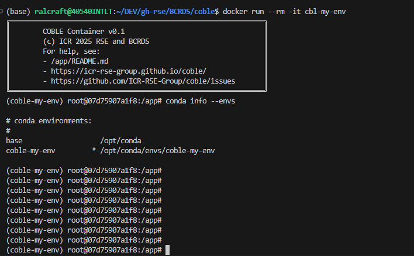
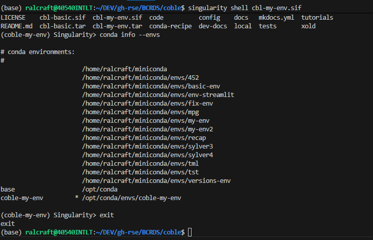

# Building Docker and Singularity Containers

Docker and Singularity images build together by passing in `--containers docker,singularity` to `build`. The default --containers is `conda`, all 3 can be passed in. Only docker can be built, but singularity necessitates docker as it is a conversion of the docker image.


```bash
coble build --recipe config/basic.cbl \
--env my-env \
--containers docker,singularity
```
As many installations use [GitHub API authntication](https://github.com/settings/tokens), it is recommended to have a GITHUB_PAT environment variable set up. It will be autimatically passed into the builds to ensure API authentication where needed. You can set this in your .bashrc in the usual way after creating the PAT in github from settings:
```text
export GITHUB_PAT="ghp_*******************************"`
```

The result of the container build are the final containers and a record of the Dockerfile for recreatibility. The top of the dockerfile contains the arguments that were passed in as BUILDARGS (parameters), and the important note is thta it passeds through the GitHub SHA as a parameter to ensure if the container is reproroduced it is with the precise version of the COBLE code.
```
.
├── `cbl-my-env.tar` # Creates a docker file
├── `cbl-my-env.sif` # Creates a singularity file
└── my_recipe_folder/
    ├── my-env.cbl
    └── my-env.Dockerfile # creates the Dockerfile that was used for recreatibility
```

Once produced these images can be used directlly on the local machine or shared as files. When they are run as bash terminals the environments are pre-activated. To run them as a command line terminal with the environments activated with the recommended paramaters included to map current working directory to workspace:

```bash
# Docker:
# Optionally load the tar if changing machines, on your own machine it is already mounted)
docker load -i cbl-my-env.tar
# Then run it
docker run --rm -it \
-v .:/workspace -w /workspace \
cbl-my-env

# download a singulariy image from docker
singularity build cbl-my-env.sif docker://cbl-my-env

# Singularity: run directly
singularity shell cbl-my-env.sif
```

The conda environment is pre-activated and they look like this:

### Docker


### Singularity
