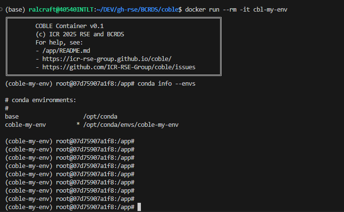
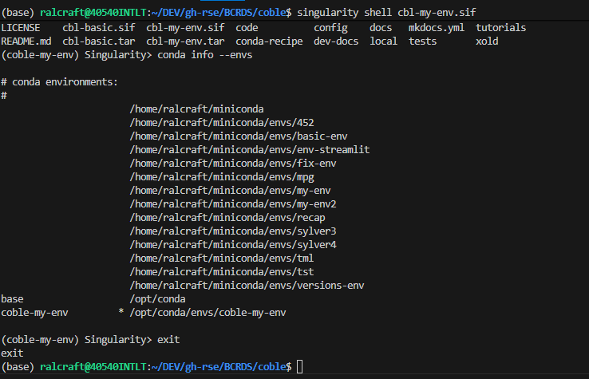

# Building Docker and Singularity Containers

Docker and Singularity images build together by passing in `--containers docker,singularity` to `build`. The default --containers is `conda`, all 3 can be passed in. Only docker can be built, but singularity necessitates docker as it is a conversion of the docker image.


```bash
coble build --recipe config/basic.cbl \
--env my-env \
--containers docker,singularity
```
As many installations use [GitHub API authntication](https://github.com/settings/tokens), it is recommended to have a GITHUB_PAT environment variable set up. It will be autimatically passed into the builds to ensure API authentication where needed. You can set this in your .bashrc in the usual way after creating the PAT in github from settings:
```text
export GITHUB_PAT="ghp_*******************************"`
```

The result of the container build are the final containers and a record of the Dockerfile for recreatibility. The top of the dockerfile contains the arguments that were passed in as BUILDARGS (parameters), including which version of the COBLE tool itself was used to do the build - see below.
```
.
├── `cbl-my-env.tar` # Creates a docker file
├── `cbl-my-env.sif` # Creates a singularity file
└── my_recipe_folder/
    ├── my-env.cbl
    └── my-env.Dockerfile # creates the Dockerfile that was used for recreatibility
```

Once produced these images can be used directlly on the local machine or shared as files. When they are run as bash terminals the environments are pre-activated. To run them as a command line terminal with the environments activated with the recommended paramaters included to map current working directory to workspace:

```bash
# Docker:
# Optionally load the tar if changing machines, on your own machine it is already mounted)
docker load -i cbl-my-env.tar
# Then run it
docker run --rm -it \
-v .:/workspace -w /workspace \
cbl-my-env

# download a singulariy image from docker
singularity build cbl-my-env.sif docker://cbl-my-env

# Singularity: run directly
singularity shell cbl-my-env.sif
```

The conda environment is pre-activated and they look like this:

### Docker


### Singularity


## Building for a specific platform, locally

The build above always builds for whatever platform the machine running it natively is. To build for a *different* platform locally - e.g. testing a `linux/arm64` image on an amd64 machine, or a `linux/amd64` image on Apple Silicon - pass `--platform` (using the same value docker/buildx itself takes):

```bash
coble build --recipe config/basic.cbl \
--env my-env \
--containers docker \
--platform linux/arm64
```

This switches to a `docker buildx build --platform ... --load` build instead of the normal one, so the resulting image lands straight in your local Docker daemon, ready to `docker run` immediately - no registry involved.

A few things that only apply to `--platform` builds:
- Only one platform at a time. Buildx's `--load` can't bring a multi-platform manifest into your local Docker daemon, so a comma-separated value like `linux/amd64,linux/arm64` is rejected outright.
- Singularity is never built here, even if you also pass `--containers docker,singularity` (it's ignored with a warning) - a `--platform` build is often for a different architecture, or even a different OS if you're on a Mac, than the machine actually running it, and there's no guarantee Singularity/Apptainer is present or usable there at all. Build Singularity images the normal way, without `--platform`, on a Linux host.
- You need Docker's buildx available (bundled with recent Docker Desktop/Engine) and emulation set up for the foreign architecture - QEMU on Linux, or Docker Desktop's own "Use Rosetta for x86_64/amd64 emulation" option on Apple Silicon, which is noticeably faster than QEMU there.
- This is a local, single-machine tool for testing - the community/CI builds (see [community.md](community.md)) don't use this path at all; they build each architecture natively via GitHub's own per-architecture runners instead.

## Which version of COBLE gets used inside the image

The container doesn't use whatever `coble` is installed on your machine to build itself - it clones a fresh copy of the tool from GitHub *inside* the Docker build. Control which version with `--code-source`:

```bash
# Default: whatever is currently on main (resolved fresh at build time, not pinned)
coble build --recipe config/basic.cbl --env my-env --containers docker

# Pin to an exact, reproducible version
coble build --recipe config/basic.cbl --env my-env --containers docker \
--code-source 7d961deb1802e64280bfc9bd25f5042c923db975
```

- **`main`** (the default) is *not* a pin - it resolves to whatever the current `main` branch is at the moment the Docker build actually runs. Running the same command again next week can produce a different image. If you need exact reproducibility, pass a specific commit SHA instead - that's the only value that's actually pinned.
- **A commit SHA** (or any real branch/tag name) checks out precisely that version. This is what you want for a container meant to reproduce a specific published result.
- **`local`** is debug/dev only - it builds using the coble checkout on your own machine instead of cloning from GitHub, so you can test an in-progress change to the coble tool itself before it's pushed anywhere. Not used by the published community/CI builds, and there's no way to point it at some other local checkout - it always uses the one the `coble` command you're running lives in.