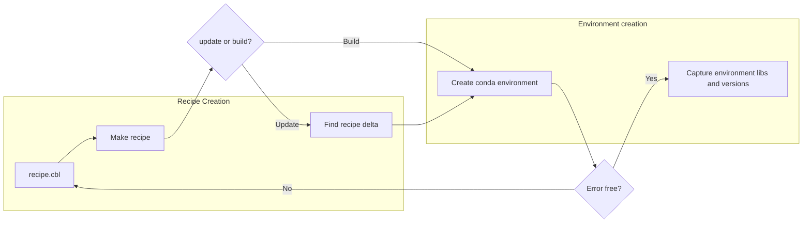

# COBLE Workflow Overview

This page describes the basic workflow for using the COBLE environment creation tool.

## Workflow-chart

---  

## Workflow Steps

1. **Find Block Resolution**
   - The tool first processes any packages listed in the `find:` block of your CBL file.
   - You will be prompted to review and confirm these packages before proceeding.
   - The CBL file is updated in place based on your input.

2. **Recipe Generation**
   - After confirmation (or if no find required), COBLE generates a recipe file (a bash script) from your CBL in the outdir.

3. **Recipe Execution**
    - No further prompting, the tool then executes the generated recipe script to create the environment.
    - By default, the process will exit immediately if any errors are encountered, allowing you to correct issues and re-run as needed.
    - You can override this behavior and continue on errors by passing the `--skip-errors` flag.

---

## log and output files

**Inputs**  
- **recipe.cbl** - The input definiton of the environment  
**Interim**  
- **recipe.cbl.recipe.sh** - the cbl transformed into a pure bash script that could be run instead  
- **recipe.cbl.recipe.sh.delta.sh** - the change in bash that will be run (for updates and resume)  
- **recipe.cbl.recipe.sh.done.sh** - each bash line that has  succesfull completed in the environment  
- **recipe.cbl.recipe.sh.old.sh** - backed up when new recipe created  
**Logs and tracking**  
- **recipe.cbl.recipe.sh.log** - each bash line cleans the log file so you can track the current stdout  
- **recipe.cbl.recipe.sh.err** - each bash line cleans the err file so you can track the current stderr  
- **recipe.cbl.recipe.sh.summary.txt** - after each install the logs are parsed for important info eg errors or dependencies. This is output along with the timings  
**Catured environment**  
- **recipe.cbl.recipe.sh.capture.cbl** - The environment is captured, all packages and libs and versions, for reproducibility this could be used to recreate the environment  

