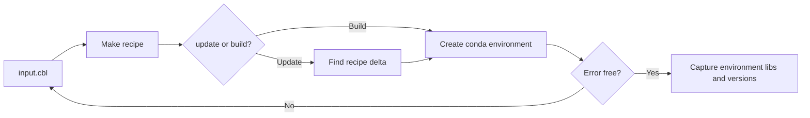

# Overview of COBLE

## Workflow



## log and output files
Inputs
```bash
input.cbl # The input definiton of the environment
```
Interim
```bash
input.cbl.recipe.sh # the cbl transformed into a pure bash script that could be run instead
input.cbl.recipe.sh.delta.sh # the change in bash that will be run (for updates and resume)
input.cbl.done.sh # each bash line that has  succesfull completed in the environment
```
Logs and tracking
```bash
input.cbl.recipe.sh.log # each bash line cleans the log file so you can track the current stdout
input.cbl.recipe.sh.err # each bash line cleans the err file so you can track the current stderr
input.cbl.recipe.sh.summary.txt # after each install the l;ogs are parsed for important info eg errors or dependencies. This are output along with the timings
```
Catured environment
```bash
input.cbl.recipe.sh.capture.cml # The environment is captured, all packages and libs and versions, for reproducibility this could be used to recreate the environment
```


