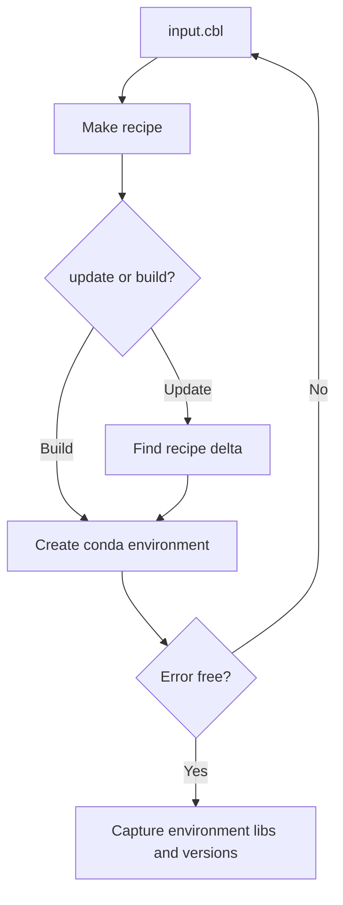

## Simple Mermaid Flowchart Example

Below is a basic Mermaid flowchart you can use in MkDocs:

```mermaid
flowchart TD
	INP[input.cbl] --> REC[Make recipe]
	REC --> UPD_BLD{update or build?}
	UPD_BLD -- Update --> DLT[Find recipe delta]
	UPD_BLD -- Build --> CRE[Create conda environment]
	DLT --> CRE	
	CRE --> ERR{Error free?}
	ERR -- No --> INP
	ERR -- Yes --> CAP[Capture environment libs and versions]	
```
