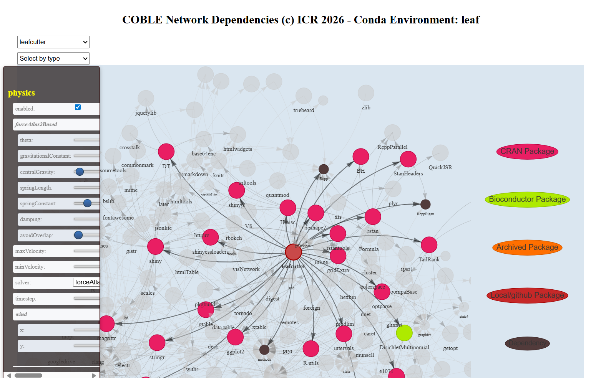

# Network Viz Graph

The build ouputs a network graph showing the dependencies and where possible additional informaton such as date.

This can also be run seperately with the function "network:
```bash
coble network --frozen my-env_feeze.cbl --env my-env
```

