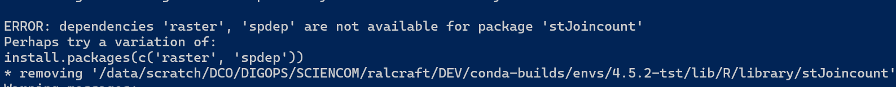

# Interactive log on with 4 cpus
# Using conda version 25.9.1 (conda --version)
cd /data/scratch/DCO/DIGOPS/SCIENCOM/ralcraft/DEV/conda-builds

# 01 FIRST TIME FOR FGSEA ######################
export CONDA_PKGS_DIRS=./pkgs/4.5.2-tst
conda create -y -p ./envs/4.5.2-tst r-base=4.5.2 python=3.14.0
conda activate ./envs/4.5.2-tst
conda install -y r-biocmanager --no-update-deps
Rscript -e "BiocManager::install('fgsea',force=TRUE)" # FAILED
# load a dependency
conda install -y r-data.table --no-update-deps
Rscript -e "BiocManager::install('fgsea',force=TRUE)" # SUCCEEDED

# 02 Now also stJoincount ######################

export CONDA_PKGS_DIRS=./pkgs/4.5.2-tst2
mkdir -p ./pkgs/4.5.2-tst2
conda create -y -p ./envs/4.5.2-tst2 r-base=4.5.2 python=3.14.0
conda activate ./envs/4.5.2-tst2
conda install -y r-biocmanager --no-update-deps
conda install -y r-data.table --no-update-deps
Rscript -e "BiocManager::install('fgsea',force=TRUE)"
conda install -y r-raster --no-update-deps
conda install -y r-spdep --no-update-deps
conda install -y r-magick --no-update-deps
#R -e "devtools::install_url('https://www.bioconductor.org/packages/release/bioc/src/contrib/stJoincount_1.12.0.tar.gz')"
Rscript -e "BiocManager::install('stJoincount',force=TRUE)"